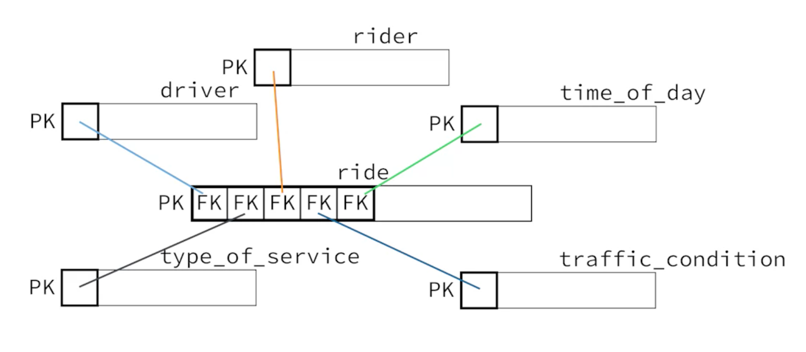

# Notes: Big Data Analysis in SQL

This note consists of fundamental of data, fundamental of SQL, traditional databases, big data and distributed cloud storages and query engines.

<!-- more -->

!!! note 

    This is my personal note of [Modern Big Data Analysis with SQL Specialization](https://www.coursera.org/specializations/cloudera-big-data-analysis-sql). This is only intended as a personal reference.

## Fundamentals of Data

Data is a representation of something that capture some features and ignore others. What this means is that there is a selective representation based on a context, purpose, complexity, managabiluty, etc... 

- Analog Data: a continuous representation of something. It has infinite values. At any given instance or point, it has a unique continuous value.
- Digital Data: a discrete representation of something. It has finite values. It is a sample representation of analog data.

For instance, a mechanical clock has a unique value at any given instance but a digital clock has a finite values that represent a section of time duration like 1 sec to 2 sec but analog clock has infinite values between 1 sec and 2 sec.

Data is store unorganized in a data store. In order to make sense of the data and easily retrieved, data is organized. Databases are used to store organized data.

## DBMS

- Is a software that lets you organize and manage your data. It gives you an interface to store and retrieve data to and from a database and share your data.

- A DBMS should have at list these four functionalities
    - **Design** how your data is stored in the database. Different data sources will be separated and have their own features.
    - **Update/Add** records into the database.
    - **Retrieve** data from the database base to answer various questions.
    - **Control access/Manage** your data. You need to be able to create accounts and manage who has access to a particular data.

## RDBMS

- In 1970 F.E CODD's paper on relational models laid the foundation for relational databases.

- In 1974 IBM created SQL to interact with relational databases. It was originally called SEQUEL hence the ambiguous pronunciation.

- In 2000s the big data era start the rise of NoSQL for non-relational datasets. For structured data relational databases are still in high demand.

In RDBMS data is being stored in a table, collection of tables is a database. SQL is used to interact with the database. Based on the four functionalities SQL commands are categorized into 4.

**Data Definition Language(DDL)**

- CREATE - create a table
- ALTER - change table property
- DROP - remove a table

**Data Manipulation Language(DML)**

- INSERT - add record
- UPDATE - update record
- DELETE - remove record

**Data Query Language(DQL) Or Query**

- SELECT - retrieve data

**Data Control Language(DCL)**

- GRANT - give data access control
- REVOKE - take away access control

Apart from this 4 major categories there are other SQL commands. Since SQL is constantly evolving there are other commands that are not in the standard sql. Due to various reasons like competition, different RDBMS have their own SQL dialect. Although for the most part they are alike.

SQL has gain a huge acceptance even non-relational data/big data management systems and query engines use it as their primary language to interact with data. System like Hive, Impala and Athena.

### Operational & analytical databases

**Operational databases:** designed to answer what is current state of a process. Optimized for fast read and write of the on going state.

**Analytical databases:** designed to answer analytical queries on a stable large historical data. Optimized for read heavy operation and complex queries.

Operational data is bulk loaded into analytical databases periodically.

Well most of the thing is pretty familiar here and no need to take notes. I will just add whatever I want to remember.

DECIMAL(n, d) - a decimal value with n number of digits and d number of those digits are to the right of the decimal point. DECIMAL(5, 2) is BETWEEN -999.99 AND 999.99.

**BLOB(Binary Large Object)**, store up to 4 gb binary data. Movies, media files…

**CLOB(Character Large Object)**, store up to 4 gb character data. Books, HTML pages…

They are not supported in most of RDBMS. Mostly they are stored separately as files.

??? example "A STAR Scenario" 
    Having multiple foreign keys as a compound primary key.
    
    

    A ride is uniquely identified as a combination of *rider*, *driver*, *time_of_day*, *type_of_service* and *traffic_condition* ids. This is smart. And this is a star schema. This way of putting it gives a different perspective of the star schema I know from big data realm.

### Normalization

**3NF**

1. **Primary key** - every table should have a primary key. Avoid intelligent keys - use a key that doesn’t have any meaning about the item.
2. **Atomic columns** - a column value should be a single value. It should not contain combination of values. In other word you should be able to manipulate the value inside a column with out loading it to memory.
3. **No repeating groups** - a column should not contain multiple records in a single row as repeating values. The repeating values should be stored in a separate table with foreign keys.
4. **Non-key columns describe only the whole key** -  non-key columns only describe about the primary key not about other non-key columns. If a non-key column describes about another non-key column, they should be stored in a separate table and referenced with a foreign key.
5. **No derived columns** - a column should not be a computed value of other columns. This is redundant and if one of the columns are changed the computed value would be incorrect.

### Denormalization

If at least one of the principles are intentionally violated we get denormalized denormalized. This doesn’t mean designing a database with out considering the normalization rules. To denormalize a best practice is to first normalize it and intentionally violate the normalize rule to achieve some thing like fast read.

**Normalization advantages**

- **Limit data anomalies**: different entities are stored in a separate tables thus
    - Adding new entity will not affect other entities
    - Updating and deleting of an entity is done at on place and will take effect everywhere.
- **Enforce data structure**:
    - Prevent you from duplicating records
    - Dependencies should be fulfilled before adding or deleting a record. This dependenceis are created with table relations.
- **Size**: since it prevents data duplication the size is much smaller.

**Denormalization advantages**

- **SELECT speed**: by reducing join operation and on query computations your SELECT query will be much faster.

Denormalization is suited for analytics databases since it is suitable for complex queries and faster SELECT speed on larger data size. 

Normalization is suited for operational databases since size is relatively small and mostly a lookup queries are performed. Normalization rules will help you to keep your data integrity.

!!! tip "Nothing but the key"

    [A non-key column should provide a fact about the key, the whole key, and nothing but the key, so help me CODD.](https://www.bkent.net/Doc/simple5.htm)
